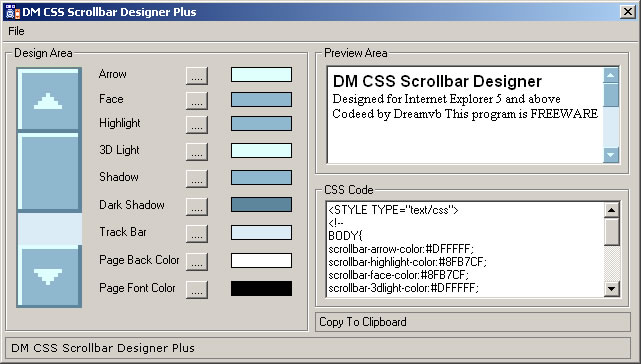



## DM CSS Scrollbar Designer Plus

### Description

Hi all this is an CSS Scrollbar maker to make colofull scrollbars for IE. I did infact want submit this about a year ago but lost the source. so I desdied yesterday to rewrite it all out for you.

ok about the program. You can design your bars in W.Y.S.I.W.Y.G style you can also have your save/load your scrollbar projects. Generator CSS code. and your also have a preview display. I also included over 20 scrollbar scheams to help you get started. hope you like it. please vote.
 
### More Info
 

             |
---                |---
**Submitted On**   |2003-09-06 01:03:32
**By**             |[dreamvb](https://github.com/Planet-Source-Code/PSCIndex/blob/master/ByAuthor/dreamvb.md)
**Level**          |Beginner
**User Rating**    |5.0 (15 globes from 3 users)
**Compatibility**  |VB 4\.0 \(16\-bit\), VB 5\.0, VB 6\.0
**Category**       |[Complete Applications](https://github.com/Planet-Source-Code/PSCIndex/blob/master/ByCategory/complete-applications__1-27.md)
**World**          |[Visual Basic](https://github.com/Planet-Source-Code/PSCIndex/blob/master/ByWorld/visual-basic.md)
**Archive File**   |[DM\_CSS\_Scr187222452005\.zip](https://github.com/Planet-Source-Code/dreamvb-dm-css-scrollbar-designer-plus__1-59837/archive/master.zip)

